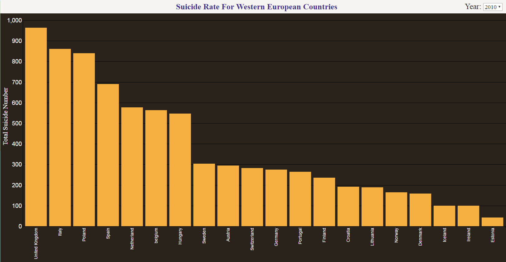
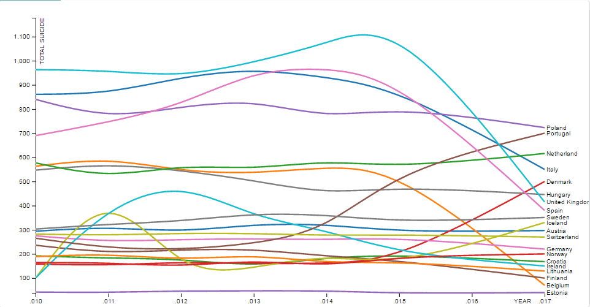

# INFORMATION VISUALIZATION PROJECT
## Introduction
##### We have seen it over the years that the suicide rates have  constantly been increasing world wide.In the past we have seen that there was a high count of female suicide but now studying the statistics, we can see that there is no much variation between the male and female suicide rate.The frightful part of the  statistics was that there is no one part of the age group that was prone to commit suicide,but I also came across suicide committed by the age group of 5-10years as well as 15-20years which is immensely schocking.The suicide statistics varies widely among the various age groups across the various countries all over the world.I thus decided to consider visualizing the data related to suicide statistics for the various countries around the world.One of the interesting reasons I chose this topic was that I was very curious to know about the variation between the male and the female suicide rates over the years in various countries of the world.Hnece I thought visualizing this would really be interesting.
##### Initially after selecting this particular datset there were various way wherein I could visualize the data.Starting with my initial question, where I wanted to show the variation between the suicide rate between male and female for one particular year for all the regions.But realizing the visual aid would not be that effcetive for it I then decided to show The variations only among the female suicide rate, as we know that the female suice count has been increasing ever since the past years. Depicting these suicide various for the various countries or the regions around the world would be something interesting to visualize.hence, I dropeed the initial question of visualizing the variations between the male and the female suicde rate over the years in various countries.Since I observed that the variation between the male and the female suice rate were pretty much very close, the visualization would not really be effective.I also refined my question to group it region wise for the countries since visulaizing for each country would be a mess. Hence I decided that my main question would address and visualize "The Female suicide rates in the Westrn European Countries".I chose this as my main question to visualize the data, Since after Exploring the data I realized that there were major transition/variations among the female suicide number in the countries of western europe when compared to the other regions of the world  which I then thought could be a great visual aid to depict the transitions.
## Data
##### The URL of the dateset - [WHO Suicide Statistics](https://www.kaggle.com/szamil/who-suicide-statistics). 
##### This data set here includes 6 main columns which are as folows - Country, Year, Age, Suicide_no, population.The country here consists of a total of 141 countries all over the world.And the year varies from  1979- 2016 which is a very wide collection of data i.e for about 37years. This time span is extremely huge to visualize the suicide statistics.This datset also consists of a column age wherein we have the various age groups that have been described like 5-14years,15-24years,25-34years going upto 75+ years. This datset gives the suicide noumber for each of these age groups and also shows the respective population for the respective country. Here for our main visualization question we need to do a simple calculation to reach out to the final suicide number. Since the suicide number is divided among various age groups of male and female we need to compute the sum of the suicide rate of all the age groups for males and female seperately.For this we sum up all the suicide number of suicide number for each age group to consolidate into one.Since it is extremely difficult to depict the suicide statistics for all the 241 countries we hence group them according to the region.And among the region I have selected the region that shows the variations of the suicide rate for females the hight which is the western european countries.hence I further refined my data file to the countries consisting only of the western european countries, which are a tottal abpout 20 countries which are present in my data set.the next step was to refine the year.Since the year scale is too large to encode or depict the ntire data on any visual aid, by the data exploratory analysis I figured out that the transitions for the years 2010-2016 is the most effective and also because it is the latest statistics hence would show the users the visualization for the latest data.Hence I derived a new file consolidating the data we require from my current dataset, i.e after summing up the age-groups and consolidating all the western european countries together.There are various ways in which this particular datset could be visualized. We could visualise this in the form of a map which depicts the various suicide rate of females around the world.We could also depict this in the form of smaller multiples of bar chart where it depicts the suicide rate against the population of a particular country or we could also depict it in form of a grouped bar chart which would depict the suicide rate of the male and female for various countries over a period of years.Finally it could be depicted like my final visualization which depicts the statistics in the form of a bar chart, western european countries against the suicide number for those countries for the years 2010-2016.
##### One of the main aspects of the data set that I am attempting to communicate is to show how the graph changes between the various european countries.On an average Which is the Country that has the highest suicide rate throughtout.The story of the chart here is that, After the visualization we could here clearly see that the female suicide rate for united kingdom is the highest throughtout the years 2010-2015. But it only suddenly drops drastically down for the year 2016.This was because the united kingdom took various preventive measures against the suicide rates where they figured the out from the previous years what the main reasons were because of which the suicide rates were so high like mental health problems,Relationship breakdown,bereavement and social loneliness and also the decrese in the population in the year 2016.Also it is an important factor that we notice that United kingdoms and italy having the highest suicide rates throughtout the years 2010-2016.And on the other hand Estonia has constatly been having the lowest suicide rate ever since the 2010-2016. One of the main reasons for this is its population ratio when compared to united kingdom.The Main reason for the united kingdom drop down suicide rate was due to the Britains exit from the european union.
## Visualization
##### I have depicted my final visualization for the question "Female Suicide rate in the Western European Countries" in the form of two graphs - bar Chart and a Time series chart.Bothe the charts besically depict the same aspect of the question, it is just depicted in the form of two different charts.
##### Bar Chart - My Bar Chart depicts the Total suicide number for females over the various european countries for the year 2010-2016. where my countries are the lined on the x-axis and the suicide number on the y-axis.The chart also has a <b>dropDown</b> box which helps the user to select the year they wish to see.By default the year is 2010 Since it is arranged in the ascending order. When the user clicks on their choice of the year the bars re-arrange themselves accoring to the data that is present in our data file.We use the two functions for the bars to move and resize themselves when the year is changed. Which are the isResize function which resizes the bar everytime the new year is selected from the drop down list and also we add an additional <b>transition</b> function which helps us to show the visualization effectively how the bars move when the years are changed.
##### Line Chart - My Line Chart again depicts the same the bar chart for the goal of the question.the variations are just shown in the form of a multi line chart.where it shows the various countries and the variations of the female suicide rate over the set of years.One of the main intereactive feature of this multi-line chart is that once you hover on the name of a particular country, you will be able to view only the line of that particular country and the resst of the lines of the other countries become invisible.We use a function of "mouseover" where we define only the country selected by the user to be visible and the rest of the country lines are given as lightgray,which makes them look almost invisible.This feature helps the user to clearly visualize which country has gone through what kind of variation over a period of time without having to change the years like the one in bar chart. It shows us the variation for all the years of how that country has had a drop or a raise in the female suicide rate over the years 2010-2016.Which is more effective than a Bar Chart.Here in this particular chart the x-axis is mapped to the years i.e 2010-2016 and the y-axis consist of the Total suicide rates and each of the line here depicts one particular country and has been given a unique color to differentiate it from the other countries.  
##### Story telling - The main aspect which I figured out through this visualization is that, the country United kingdom has the highest suicide rate constantly over the years 2010-2015 but suddenly the suicide rate of the united kingdoms drops in the year 2016.One of the main reasons for this drop is the brexit, which in the economic perspective was advantageous for the increament in the employment rate which was also considered one of the major factors in the reduction of the suicide rates.And in the year 2014 the resession hit the united kingdom due to which we see a higher percentage of suicide rates in the year 2014,2015.but in the year 2016 another cause why it drops is since the country worked on its constant increase in the suicide rate which were lead by various reasons such as mental health problems,Relationship breakdown,bereavement and social loneliness and was able to give better aid to the suicide patients.My final visualization here both the bar chart and the line chart clearly show-cases the transitions of the suicide rates for the years in various countries.Line chart helps us to easily look at the variations of a single country where as the bar chart helps us to campare it simultaneously for various countries for a particular year. 
######   *Bar Chart*
######   *Line Chart*
## Design Decisions
##### The major Design decision here was the selection of the type of chart to be used.I rejected depicting the visualization in the form of map which I had firstly thought of since a few countries of europe were extremely small and hence would become very clumpsy when depicted on the map.I also rejected creating of the smaller multiples since there were too many of them.Since Years were involved design to depict the that was to use multi-line chart which would effectively depict the data and mark their variations in the chart.Another Important chart which would simultaneously show the variations for one partcular year for various countries was the line chart with the isResize() function which would effectively show how the bars re-sized themselves on the change of the option selected by the user.
##### Bar Chart - The idiom used in the bar chart is the align which is mapped to the color saturation. And the chart here is mapped to the vertical position which is mapped to the number of the suicide rate and the horizontal axis is mapped to the list of western european countries.The size here is mapped to the length vertically of the bar which shows us the variation of the suicide rate.And most importantly the mark used here the line.And as we can see in the graph the vertical scale that is the y-axis is mapped to the number of female suicide rate  and the horizontal scale that is the x-axis is mapped to the various european countries.here the sorting technique is also used which is implemented on the bars.Where in the bars re-arrange themselves and automatically re-size themselves as soon as the choice of the user changes from the drop down menu.This is done by using the isResize() which shows these transition in the bars.All these together make the bar chart look very effective and appropriate which gives a good look to the visualization and also makes the chart interactive for the user.
##### Line chart - The idiom used here in the line chart was to manupalate the the lines depicting the various female suicide rates for the western european countries for a period of time.The mark that we have used here is a line which is mapped to the various western european countries  and it is also linked with spatial attributes which effects the data which changes on the spatial position of the line.the other categorical attribute we have used here is the color hue where in each of the western european country is represented by one color to differentiate it from the other country.When it comes to the scale the x-axis is mapped to the the list of years from 2010-2016 and the y-axis is mapped to the Total number of female suicide rate.The on-mousehover feature of the chart makes the chart look more effective.This is the main feature for the chart which makes the chart very interactive for the user and the visualization more effective.When a user hovers on a particular country only that particular country's line is made visible and rest  all the countries, the line is made invisible by making use of the same hover functions.All these features together make the chart look more effective.
## Development Process
##### The development process included the process of creating both - the bar chart and the line chart using D3.jsIt was pretty difficult task to firstly finalize the chart that I was going to use for my visualization since the dataset was in such a form that it could be visualized by using various charts.It could have been visualized using a line chart,bar chart,grouped bar chart,maps, smaller multiples.But again one of the main limitation was the complexity of the code and to implement the in the form of thye chart. hence looking at both of these complexities I finally decided to depict this visualization in the formn of a line chart and a bar chart also cobnsidering the effective depiction of both the charts.the main task in both of the charts was that to figure out what exactly have to be shown in the chart via the visualization. Hence the very next task was to consolidate the data in that particular format to visualize amopng those both charts.To start with I started of with the bar Chart.here the main task initially was to get both the scales and the bars for one particular year.Once that was implement then I implemented the feature of the dropdown box wherein the users could select their choice of year they wanted from the drop down option.The next main task was to implement the transition between the bars once the dropdown was implemented so that the bars move and re-size themselves accordingly when the dropdown option was changed. I worked on implementing this chart for about two whole days.the main aspect that consumed most of the time implementing my barchart was the implementation of the dropdown box.the second chart that i have shown is the line chart.Again as mentioned earlier the main task in implementing a line chart was the manupalation of the dom elements to get the scale of x and y axis.As seen in the chart if a particular user hovers on any particular country only the line of that particular country stays opaque and the lines of the rest of the countries becomes invisible,this feature is implemented by using the on mousehover function.The most difficult feature to implement in this chart was the implementation of the hover function which was a little tricky and I had to study about the opacity and how to implement that in the code. To code this particular line chart took about one entire day where in I had to clean the data according to the requirement of the line chart and then implement it on the code.
## Final Visualization project - https://www.cs.odu.edu/~apramod/
## References
* [Adding drop down menu](https://blockbuilder.org/dougdowson/9732115)
* [To create a simple bar chart](https://blockbuilder.org/ftan3/c40c7cd8e1c9f5ca8cfb29e77bda602b)
* [Multi-series line chart](https://blockbuilder.org/63anp3ca/3a78d8ab5ab9e6c8b7601f7ea1fbd93d)
* [Time series chart](https://blockbuilder.org/PatMartin/4ac4ee837b121953e272ff576b75da6c)
* [On mouse-hover function](https://stackoverflow.com/questions/10805184/show-data-on-mouseover-of-circle)
* [w3 schools Basic svg Tutorials](https://www.w3schools.com/graphics/svg_intro.asp)
